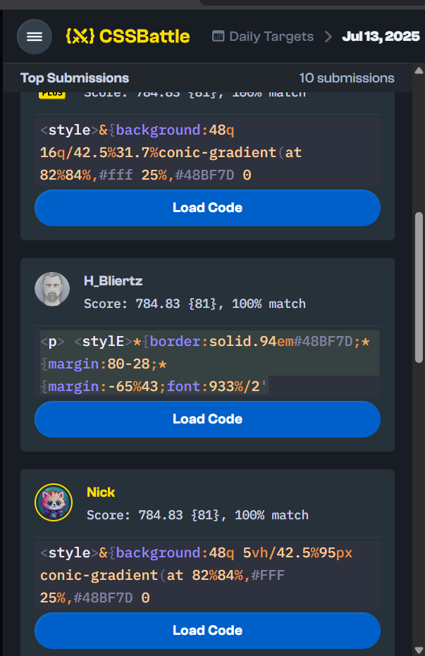
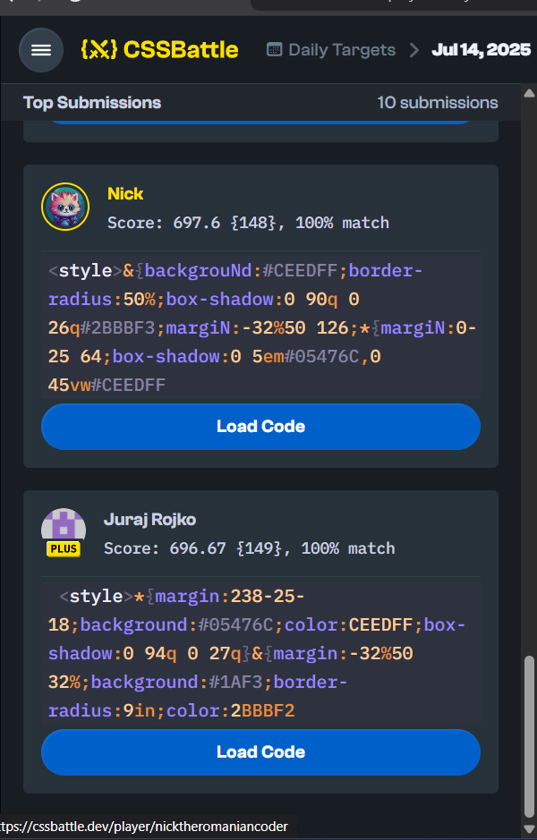
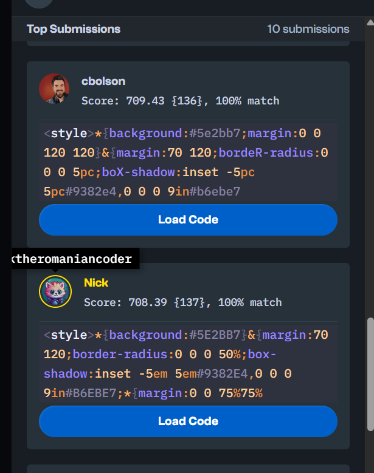
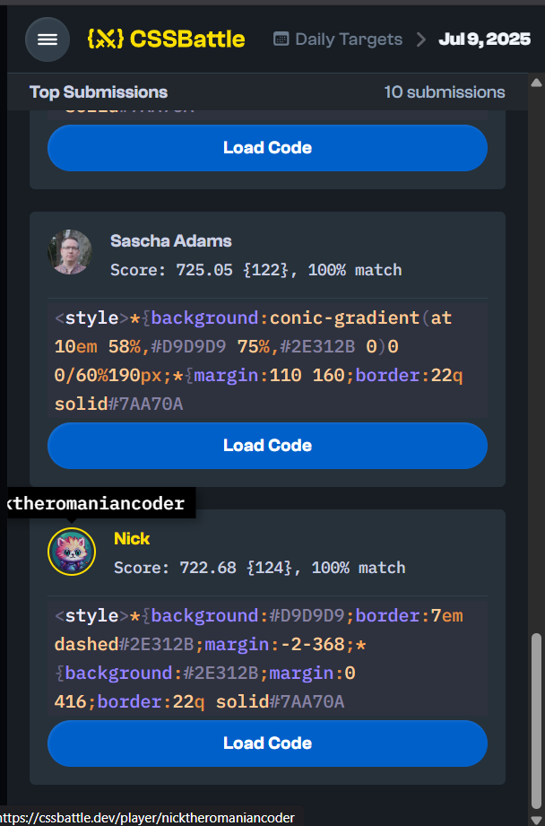

# CSS Battle

## Badges

## About

This repo is a personal archive of my CSSBattle daily challenge solutions from 2025.  
You'll find clean, minimal CSS snippets optimized for shortest possible code, plus occasional Top 10 finishes.

## Contents

- [About](#about)  
- [Badges](#badges)  
- [My Solutions](#my-solutions)  
- [Notable Solutions](#-notable-solutions)  
- [Some Notable Dates](#-some-notable-dates)  
- [License](#license)  
- [Contact](#contact)

## My Solutions

This repository contains my personal solutions to CSSBattle daily targets from 2025,  
as well as some top submissions from other players that I found interesting or inspiring.  

Many thanks to the more experienced CSS battlers. I've learned a lot by studying their techniques and creative approaches.

## 📁 Monthly Solutions

Browse all my CSSBattle submissions by month:

- [April 2025](./2025/April/)
- [May 2025](./2025/May/)
- [June 2025](./2025/June/)
- [July 2025](./2025/July/)
- [August 2025](./2025/August/)
- [September 2025](./2025/September/)
- [October 2025](./2025/October/)
- [November 2025](./2025/November/)
- [December 2025](./2025/December/)

## 🌟 Notable Solutions

While this is primarily a personal archive, a few of my solutions have placed in the Top 10 on daily challenges.  
Below are some examples:

 
📷 View Top Submissions Screenshots
   
 <table> <tr> <td align="center">   <b>13 Jul 2025</b> </td> <td align="center">   <b>14 Jul 2025</b> </td> </tr> <tr> <td align="center">   <b>25 Jun 2025</b> </td> <td align="center">   <b>9 Jul 2025</b> </td> </tr> </table> 
 

## License

This project is licensed under the MIT License - see the [LICENSE](./LICENSE) file for details.
